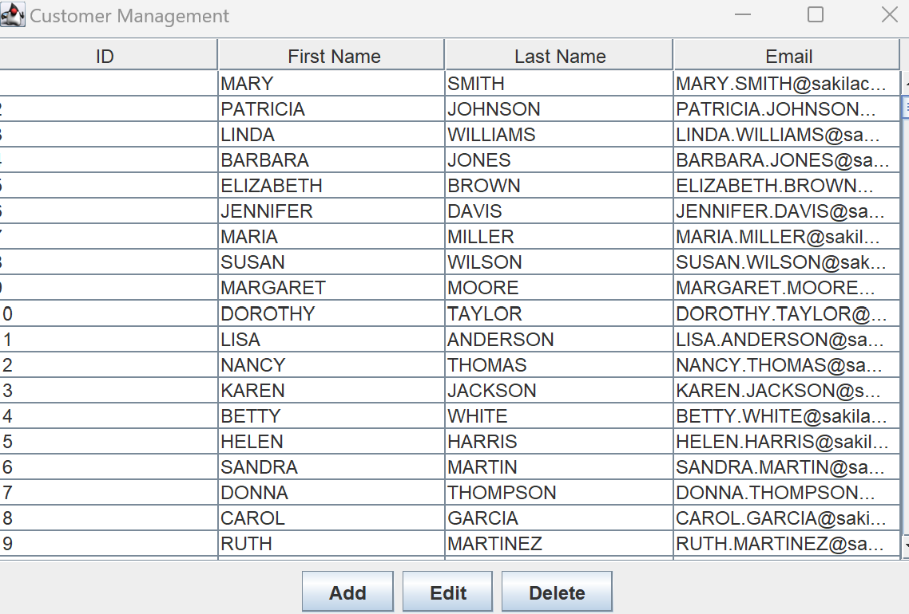
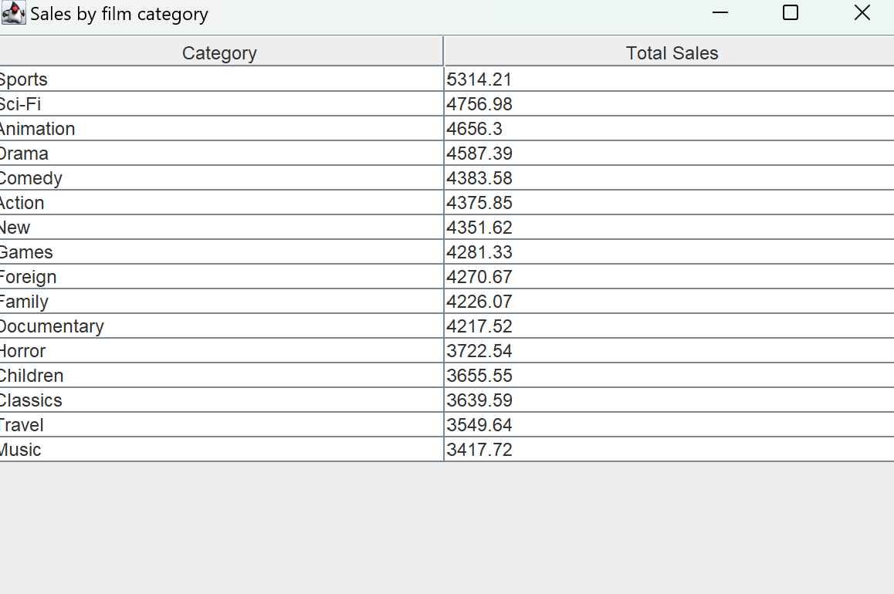
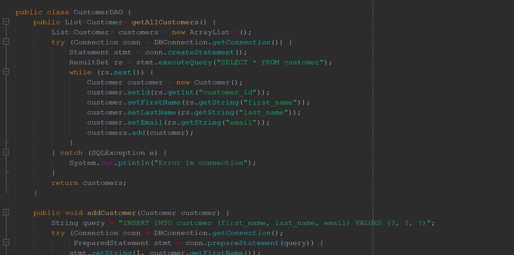
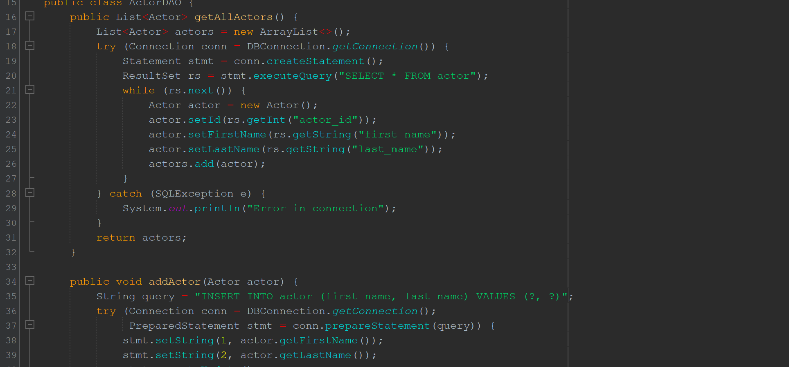
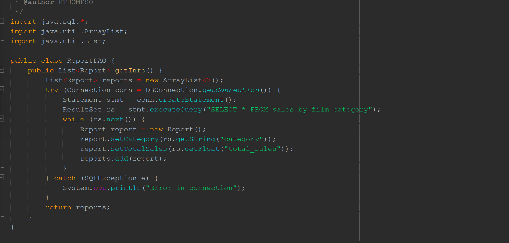

# Advanced Programming Final Project
## Author
Evan Scheerer 
Catawba College 
CIS 3400 Advanced Programming, Fall 2024 
Dr. Pamela Thompson (instructor) 

## Purpose

The final project consists of programming and implementing an advanced Java application that demonstrates database connectivity with CRUD (Create, Read, Update, Delete) actions on relational database tables using a GUI interface. The application requires a login to the database (Sakila in MySQL), with GUI forms using Swing for a main interface and selections for creating, reading, updating and deleting records from tables in Sakila, and a report. The GUI is required to be professional with a MVC design *Naster - View - Controller),  and user friendly with appropriate error handling.
 

## Project Features

Screenshots and explanation of code to include database EERD and GUI screenshots, plus some codeMbr>
  Main menu for project: 
   

customer table for project: 
   

  Actors Table for project: 
   

  Reports Table for project: 
   

  Customer code for project: 
   

  Actors code for project: 
   

  reports code for project: 
   

 

## Software Specifications

Software specifications: 
  Java (version) 
  MySQL (version) 
  Netbeans (version) 

 

## Contact Information
Evan Scheerer
escheere22@catawba.edu

